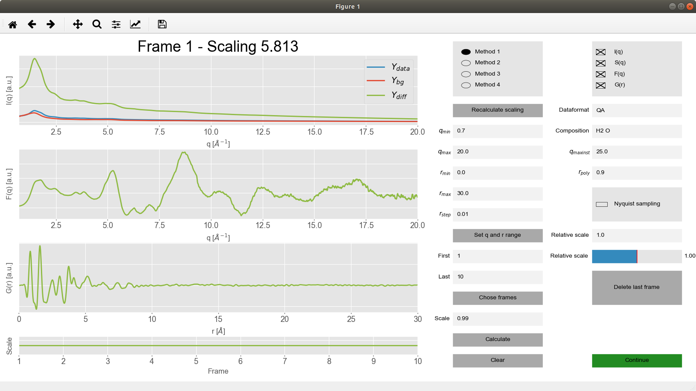

# Pair Distribution Function converter
## Introduction
This code 
```
dsafd
```
## Installing

## Example




## Author

## License
This project is licensed under the MIT License - see the [LICENSE.md](LICENSE.md) file for details


